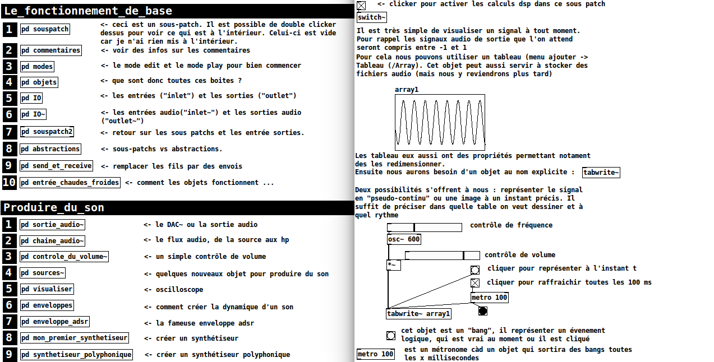

# Introduction_Pure_Data

This repository is a french introduction to Pure-Data, a digital signal processing programming language.

Cette contient des ressources pour un cours d'initiation à Pure-Data. Les patchs pure-data contiennent des commentaires et des explications sur comment procéder. Il suffit donc de disposer d'une version de pure-data vanilla d'installée, et d'ouvrir ces un de ces deux patches.

Le code est les fichiers sont disponibles sur ce dépôt [github](https://github.com/b2renger/Introduction_Pure_Data)

1-Pd~.pd : une introduction à Pure-Data.

2-Rjdj.pd : une présentation de l'excellente collection d'abstraction rjdj.

3-Les patchs préfixés par "GTD" (Getting Things Done) : proposent des techniques déjà pré-assemblées pour démarrer rapidement sur l'utilisation des samplers (granulaires ou non), des synthés (mono ou polyphoniques) etc.

## Contenu des sous dossiers :

* **/abs** : abstractions constuites pour le cours compatible vanilla. Necessaire pour 1-PD~.pd
* **/assets** : images ci-dessus.
* **/Andy-SoundEffects** : patches de synthèse sonore d'Andy Farnell, ils ont été modifiés légérements et classés, les abstractions sont rassemblées dans les différents dossiers préfixés "z_*".
* **/communication_osc** : un exemple illustrant la communication bi-directionnelle entre un sketch processing et un patch pure-data
* **/list-abs** : abstractions permettant de gérer des listes de données comptatibles vanilla
* **/rj** : collection d'abstractions de l'appli rjdj compatibles vanilla. Necessaire pour 2-Rjdj.pd
* **/stats** : collection d'abstractions pour faire des statistiques (moyennes, variances, k-means etc.)

## Références artistiques et projets utilisant pure-data

* chdh - Egregore : http://www.chdh.net/egregore.php

* Onyx Ashanti : https://www.ted.com/talks/onyx_ashanti_this_is_beatjazz?language=en

* Marco Donnarumma :  http://marcodonnarumma.com/works/xth-sense/  - https://vimeo.com/152710490

* Seb piquemal et Tim shaw - murmurate : http://funktion.fm/projects/fields-infos

* Katja Vetter : https://www.youtube.com/watch?v=oML8PzMu3Zs

* Cascada de Rubén D'Hers : https://www.youtube.com/watch?v=hGp0o7J0OCI

* Nicolas Maigret - Pure Data read as pure data : https://vimeo.com/18656762

* Open House - Music from contact mic : https://vimeo.com/13211298

* netpd : http://www.netpd.org/About

* radio de musique générative : http://randio.apsu.it/ 

* ninja jam : http://ninjajamm.com/

* album expr~ by 0xA : https://gosub10.org/GOSUB10-004.html

### Les différentes versions de Pure-Data

* pd-vanilla : la version developpée et maintenue par Miller Puckette - disponnible pour windows, osx, linux, et une version arm pour raspberry pi.

* deken : le système de management des librairies externes qui a été fait pour pd-extended - https://github.com/pure-data/deken

* pd-extended : vielle version de Pure-Data qui incluait des objets developpés par la communauté, cette version n'est plus maintenue et il est possible qu'elle se comporte variable en fonction des os et des machines - il vaut mieux éviter de developper avec.

* purrr-data : probablement le futur de pd-extended, mais cette version de pure-data est encore en beta - https://git.purrdata.net/jwilkes/purr-data

* libpd : la version librairie de pd-vanilla. Elle permet d'intégrer ses patchs pure-data dans du code tiers et est compatible avec de nombreux langages et environnements de developpement - https://github.com/libpd/libpd

* pd on mobile devices via libpd : 

	* droidparty (ios) : http://danomatika.com/code/pdparty

	* droidparty (android) : http://droidparty.net/

	* sceneplayer(android) : https://play.google.com/store/apps/details?id=org.puredata.android.scenes&hl=en

	* mobmuplat (ios & android) : http://danieliglesia.com/mobmuplat/

	* ppp (android) : http://ppp.mgsx.net

* pd dans unity :
	
	* uPd : https://github.com/Magicolo/uPD

	* UnityLibpd : https://github.com/Wilsonwaterfish/UnityLibpd

* webpd : un port partiel de pure-data pour le web, via la web audio api - https://github.com/sebpiq/WebPd

* camomille : https://github.com/pierreguillot/Camomile

* heavy : un compileur permettant d'obtenir du code C optimisé à partir de vos patchs pd

	* bella - low latency plateform for audio projects (after the rpi prototype): http://bela.io/
	
	* mogees - https://www.youtube.com/watch?v=30xWm0fyqsc

### Ressources

* Browser d'aide intégré à Pure Data (une mine d'informations) : Help->Browser et le livre Miller Puckette - The theory and technique of Electronic Music : http://msp.ucsd.edu/techniques.htm

* Andy Farnell : https://mitpress.mit.edu/books/designing-sound

* Pd vanilla official home pages http://www-crca.ucsd.edu/~msp/software.html

* Pd community pages http://puredata.info/ et http://puredata.hurleur.com/

* Forum francophone codelab : http://codelab.fr/

* Iohannes kriedler : http://www.pd-tutorial.com/

* Rafael Hernandez : https://www.youtube.com/playlist?list=PL12DC9A161D8DC5DC

* Floss manual : https://fr.flossmanuals.net/puredata/introduction/ ,
https://flossmanuals.net/PureData/

* Mgsx - émulateur sfxr : http://www.mgsx.net/articles/pd/bfxr-like-with-pd/bfxr-like-with-pd.html

### Des Patchs

* rjdj : https://github.com/rjdj/rjlib

* patchrepo = archives du forum : http://www.pdpatchrepo.info/

* ableton link : an object to synchronize with ableton link protocol - https://github.com/libpd/abl_link

* ancienne radio de musique générative : https://github.com/rumblesan/Radio-Patches

* la malinette : http://codelab.fr/5933#p31646
