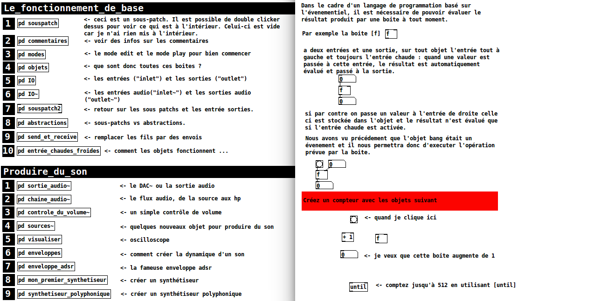

# Introduction_Pure_Data
This repository is a french introduction to Pure-Data, a digital signal processing programming language 

Ce repositotry contient des ressources pour un cours d'initiation à Pure-Data. Les patchs pure-data contiennent des commentaires et des explications sur comment procéder. Il suffit donc de disposer d'une version de pure-data vanilla d'installée, et d'ouvrir ces un de ces deux patches.

1-Pd~.pd : une introduction à Pure-Data
2-Rjdj.pd : une présentation de l'excellente collection d'abstraction rjdj.

###Contenu des sous dossiers :

* /abs : abstractions constuites pour le cours compatible vanilla. Necessaire pour 1-PD~.pd
* /assets : images ci-dessus.
* /Andy-SoundEffects : patches de synthèse sonore d'Andy Farnell, ils ont été modifiés légérements et classés, les abstractions sont rassemblées dans les différents dossiers préfixés "z_*".
* /list-abs : abstractions permettant de gérer des listes de données comptatibles vanilla
* /rj : collection d'abstractions de l'appli rjdj compatibles vanilla. Necessaire pour 2-Rjdj.pd
* /stats : collection d'abstractions pour faire des statistiques (moyennes, variances, k-means etc.)

###Ressources
* Browser d'aide intégré à Pure Data (une mine d'informations) : Help->Browser
* Andy Farnell : http://obiwannabe.co.uk/tutorials/html/tutorials_main.html
* Pd vanilla official home pages http://www-crca.ucsd.edu/~msp/software.html
* Pd community pages http://puredata.info/ et http://puredata.hurleur.com/
* Forum francophone codelab : http://codelab.fr/
* Iohannes kriedler : http://www.pd-tutorial.com/
* DIY2 by hardoff : http://forum.pdpatchrepo.info/topic/1877/diy2-effects-sample-players-synths-and-sound-synthesis
* mmb by maelstrom (coeff biquad / band limited oscillators) : https://github.com/dotmmb/mmb
* rjdj : https://github.com/rjdj/rjlib
* Synthèse concatenative : https://sites.google.com/site/eargram/download